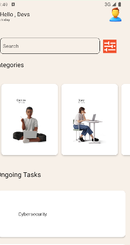
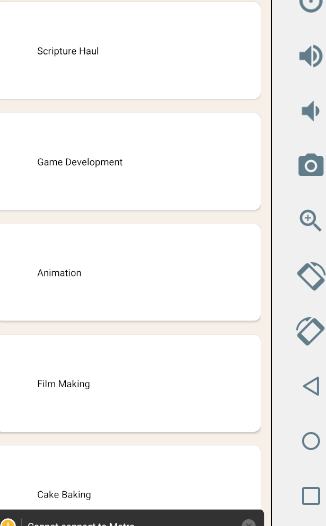

## Description
View, Text, ScrollView, TextInput, Stylesheet, Button, FlatList, and Image. The component displays a scrollable list of images and text using a FlatList inside a ScrollView, with a TextInput at the top for user input and a Button at the bottom for performing some action. The styles are defined using the Stylesheet API.

## Student ID

My student ID is 11204907